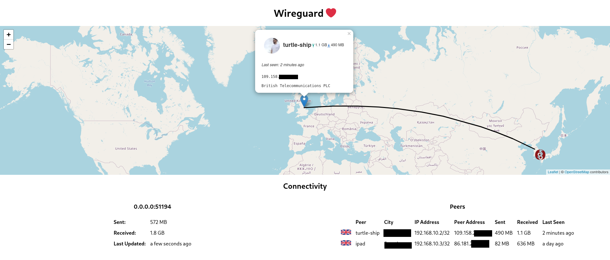

# Wireguard Map

Given access to a [github.com/jspc/wg-sock-stats](github.com/jspc/wg-sock-stats) instance with `CheckPTR` set, draw a map of the world, annotating with the approximate location of each peer.

Additionally drawing some connection metadata.

## Usage

First, install and run [https://github.com/jspc/wg-sock-stats/](https://github.com/jspc/wg-sock-stats/). This example assumes `wg-sock-stats` is listening on the default unix socket at `/var/run/wg-sock-stats.sock`, and that `check_ptr` is set in the `wg-sock-stats` config (for best results, of course, set `map_owners` to true, and fill out ownership information for public keys too).

```bash
$ docker run -p 0.0.0.0:8080:8080 -v /var/run/wg-sock-stats.sock:/var/run/wg-sock-stats.sock -e STATS_ADDRESS=unix:///var/run/wg-sock-stats.sock jspc/wg-map
```

From there, visit http://localhost:8080 (or, if running on a different host, that address with port 8080)


